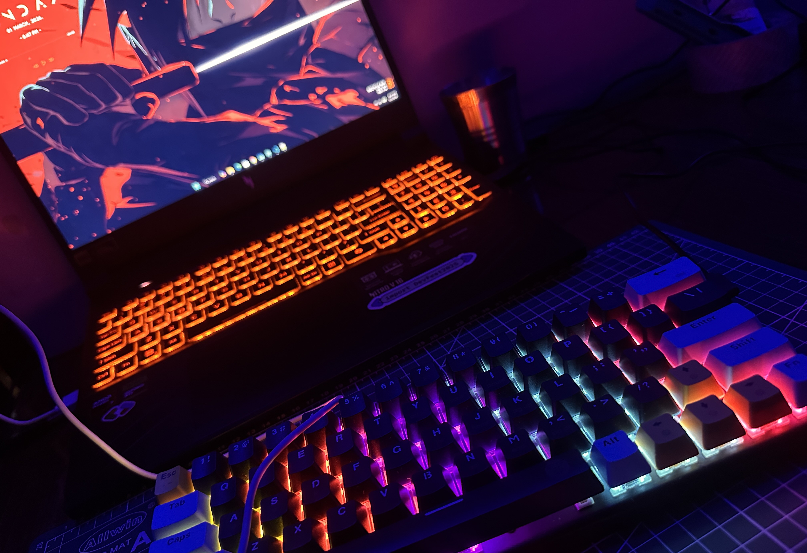
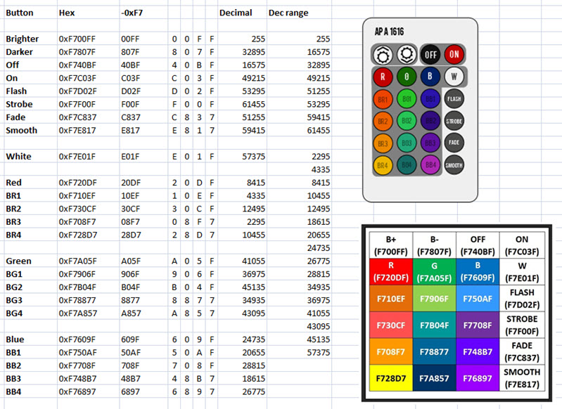
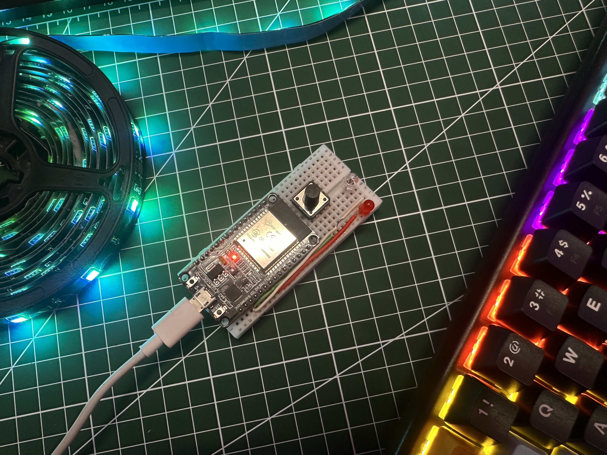
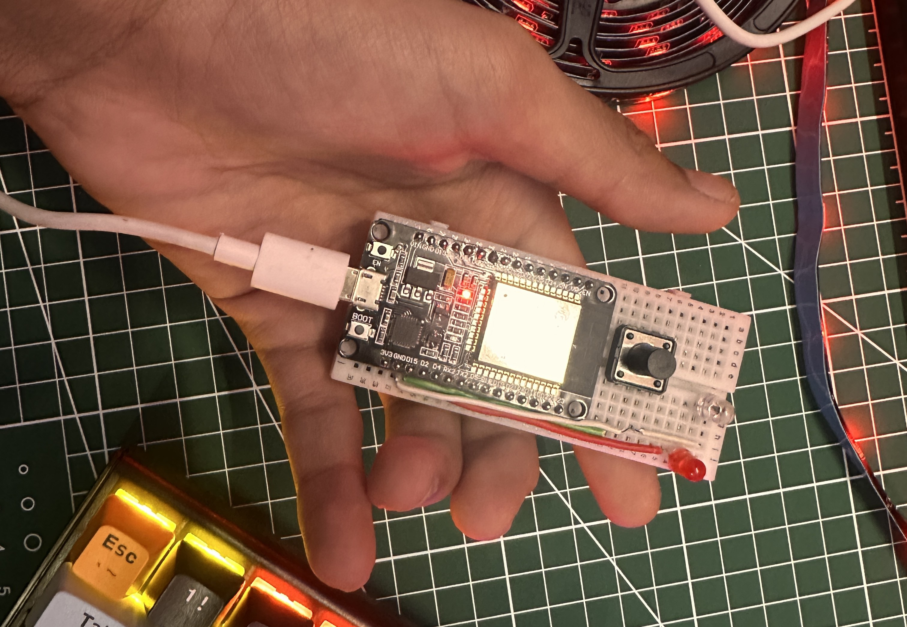
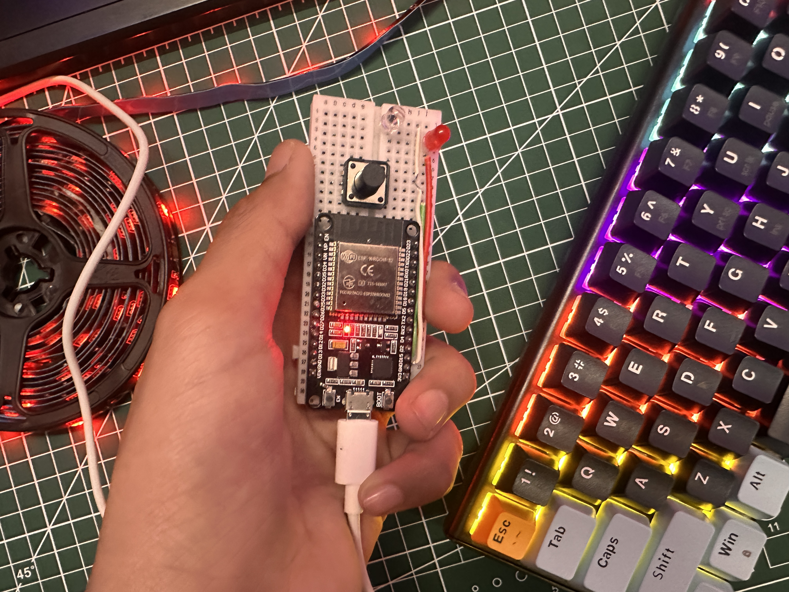
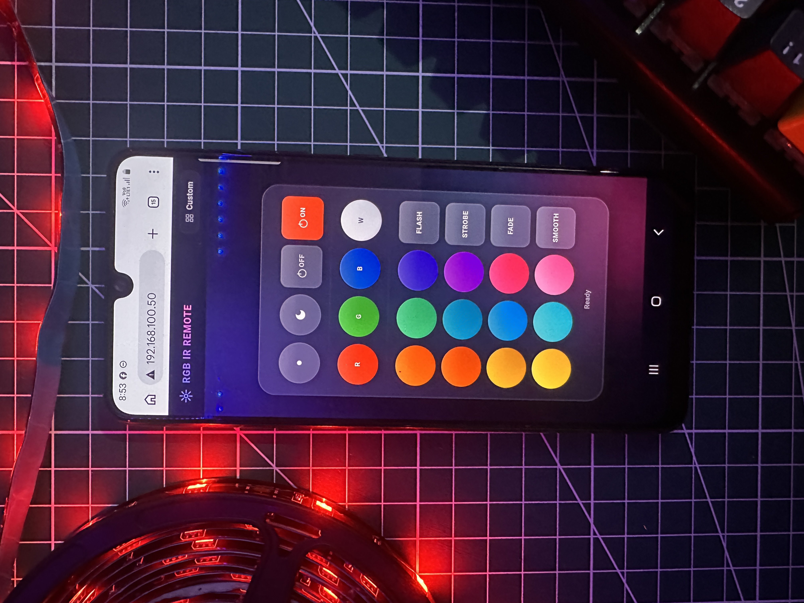
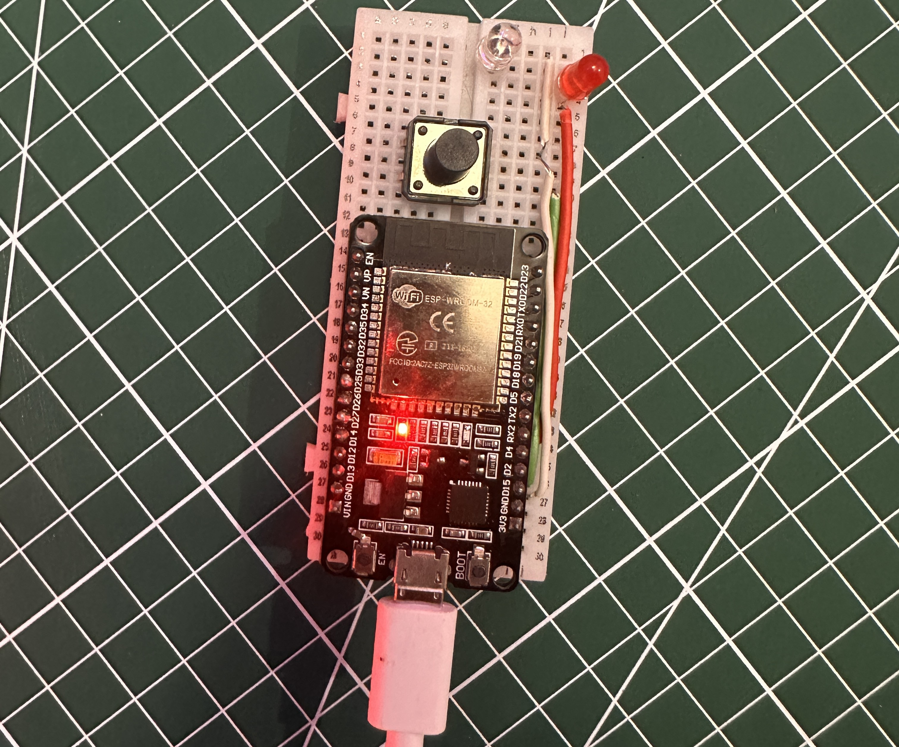

<p align="center">
  
</p>

<h1 align="center">ESP32 Universal IR Remote Controller</h1>

<p align="center">
  <strong>A WiFi-based IR blaster that replaces a 24-key RGB LED strip remote</strong><br>
  Built with an ESP32, an IR LED, and a story of engineering revenge.
</p>

<p align="center">
  
  
  
  
</p>

<p align="center">
  <b>Author:</b> <a href="https://sakshyambastakoti.com.np">Sakshyam Bastakoti</a>
</p>

---

## The Story Behind This Project

To make my room look cooler, I did what every broke college tech guy does — I bought the cheapest RGB strip available. Obviously the *"premium ultra-mega-super"* Chinese edition, because college doesn't pay me and my wallet believes in minimalism.

I came back to my room excited. Plugged it in. **Boom.** The strip turned on. Instant happiness.

Then I grabbed the remote. Pressed ON.

Nothing.

Pressed harder. Still nothing. Changed battery. **Nothing.**

<p align="center">
  <br>
  <em>The remote that started it all — retired, replaced, and outclassed.</em>
</p>

At that moment, I realized something very important:

> The LED strip was alive. The remote... was spiritually gone.

For a few seconds I just stared at the ceiling like a defeated engineer. Then it hit me.

*"Wait... I literally build robots."*

Why am I emotionally losing to a ₹200 remote?

So I went into full engineering mode. I took an IR sensor, removed its LED, grabbed my ESP32, connected a button, and opened the serial monitor like it was a battlefield control panel.

<p align="center">
  <br>
  <em>The IR sensor — my weapon of choice to decode every signal.</em>
</p>

<p align="center">
  <br>
  <em>The setup — ESP32, IR LED, wires, and determination.</em>
</p>

- **Step one:** Understand the IR codes.
- **Step two:** Replicate them.
- **Step three:** *Become* the remote.

Hex codes started flying on the screen like:

```
0xF720DF
0xF7A05F
```

It looked less like color control and more like I was launching a satellite from my desk.

<p align="center">
  <br>
  <em>Engineering mode: activated.</em>
</p>

After some wiring, some coding, and one dramatic *"please work"* moment... I pressed my homemade button.

**The strip turned on.**

I froze.

Pressed it again. **It changed color.**

<p align="center">
  <br>
  <em>It's alive — and it listens to me now.</em>
</p>

That's when I realized something powerful:

> The remote didn't fail. It *resigned*.

In less than an hour, I built my own custom IR controller using an ESP32 and a button. A broken cheap product turned into a personal robotics flex.

And yes, thank you Claude Opus... but let's be honest... **it worked because I worked.**

Now when people see my RGB lights glowing smoothly, they think I just bought a cool setup. They don't know the original remote is sitting in a drawer... retired... replaced by something smarter.

**Moral of the story:**

> *If you do robotics, even a faulty remote should be scared of you.*

---

## Web Dashboard

<p align="center">
  
  &nbsp;&nbsp;&nbsp;
  <br>
  <em>Liquid glass UI — control your RGB strip from any browser.</em>
</p>

---

## Features

- **WiFi Manager Portal** — Configure WiFi from your phone, no code editing needed
- **Auto-Connect** — Remembers your WiFi across reboots (saved in NVS flash)
- **Multi-Device Access** — Any device on the same network can control the strip
- **mDNS Support** — Access via `http://irremote.local` (no need to remember the IP)
- **Auto-Reconnect** — Automatically reconnects if WiFi drops
- **WiFi Reset** — Hold BOOT button at startup, or tap "Reset WiFi" in the web UI
- **Hardware Mode Button** — Physical push button cycles through 21 colour/effect modes
- **Liquid Glass UI** — Glassmorphism design with frosted glass cards, animated background orbs, and SVG icons
- **Remote Page** — Button layout matches the physical 24-key remote exactly
- **Custom Commands Page** — Separate page for Quick Send and custom buttons
- **Color-Coded Circular Buttons** — Gradient colours matching the real remote
- **Ripple Animation** — Visual ripple feedback on every tap
- **Quick Send** — Enter any arbitrary HEX code and transmit instantly
- **Custom Buttons** — Create, edit, delete your own buttons
- **Persistent Storage** — Custom buttons survive reboots (saved in ESP32 NVS flash)
- **Mobile Responsive** — Designed for phones, works on any screen size
- **Serial Logging** — Every IR transmission logged for debugging

---

## Hardware Required

<p align="center">
  <br>
  <em>The finished device — compact, wireless, and smarter than the original remote.</em>
</p>

| Component | Details |
|-----------|---------|
| ESP32 Dev Module | Any ESP32 board (e.g. ESP32-WROOM-32) |
| IR LED | 940nm or 850nm infrared LED |
| Resistor | 100Ω–220Ω (for IR LED current limiting) |
| Push Button | Momentary push button for mode cycling |
| NPN Transistor (optional) | 2N2222 or similar — boosts IR range significantly |

### Wiring Diagram

```
IR LED (short range ~2m):

    ESP32 GPIO 4 ──── 100Ω ──── IR LED Anode (+)
                                IR LED Cathode (-) ──── GND


IR LED with transistor (long range ~8m+):

    ESP32 GPIO 4 ──── 1kΩ ──── Base (2N2222)
                               Collector ──── IR LED Cathode (-)
                               Emitter  ──── GND
    3.3V ──── 22Ω ──── IR LED Anode (+) ──── Collector (above)


Mode-Cycle Button:

    ESP32 GPIO 15 ────┤ Button ├──── GND
    (uses internal pull-up, no external resistor needed)
```

> **Tip**: Using an NPN transistor dramatically improves IR range. The transistor switches the LED with more current than the ESP32 GPIO can provide directly.

---

## Required Libraries

Install via **Arduino IDE → Sketch → Include Library → Manage Libraries**:

| Library | Author | Version |
|---------|--------|---------|
| **IRremote** | Armin Joachimsmeyer | **4.x** (v4.2.0 or later) |

All other libraries are built into the ESP32 Arduino Core:
- `WiFi.h`, `WebServer.h`, `DNSServer.h`, `ESPmDNS.h`, `Preferences.h`

---

## Step-by-Step Upload Instructions

### 1. Install Arduino IDE
Download from [arduino.cc](https://www.arduino.cc/en/software) (version 2.x recommended).

### 2. Install ESP32 Board Support
1. Open **File → Preferences**
2. In "Additional Board Manager URLs", add:
   ```
   https://raw.githubusercontent.com/espressif/arduino-esp32/gh-pages/package_esp32_index.json
   ```
3. Open **Tools → Board → Boards Manager**
4. Search for **esp32** and install **"esp32 by Espressif Systems"**

### 3. Install IRremote Library
1. Open **Sketch → Include Library → Manage Libraries**
2. Search for **IRremote**
3. Install **"IRremote" by Armin Joachimsmeyer** version **4.x**

### 4. Open the Project
1. Open **File → Open** and navigate to `Universal_IR_Remote.ino`
2. Arduino IDE will open all project files in tabs

### 5. Configure Board Settings

| Setting | Value |
|---------|-------|
| Board | ESP32 Dev Module |
| Upload Speed | 921600 |
| CPU Frequency | 240MHz (WiFi/BT) |
| Flash Frequency | 80MHz |
| Flash Mode | QIO |
| Flash Size | 4MB (32Mb) |
| Partition Scheme | Default 4MB with spiffs |
| Port | (your ESP32 COM port) |

### 6. Upload
1. Connect ESP32 via USB
2. Hold **BOOT** button (if needed)
3. Click **Upload** (→ arrow button)
4. Release BOOT once upload starts
5. Wait for "Done uploading"

### 7. First-Time WiFi Setup
1. After uploading, the ESP32 creates a WiFi network called **`RGB_IR_Setup`**
2. Connect to it from your phone or laptop (open network, no password)
3. A **WiFi Setup** page opens automatically (captive portal)
4. If it doesn't auto-open, go to `http://192.168.4.1`
5. **Select your home WiFi** from the scanned list
6. **Enter the password** and tap **Connect**
7. The ESP32 saves the credentials and reboots
8. It now connects to your home WiFi automatically!

### 8. Find the IP Address
1. Open **Tools → Serial Monitor** (baud: 115200)
2. Press the ESP32 **RST** button
3. You'll see:
   ```
   [WiFi] Connected!
           IP   : 192.168.1.42
   [mDNS] http://irremote.local
   ```

### 9. Use It
1. Make sure your phone/laptop is on the **same WiFi network**
2. Open a browser and go to:
   - `http://192.168.1.42` (your actual IP)
   - **or** `http://irremote.local` (mDNS)
3. You'll see the remote control UI!

### Changing WiFi Network Later
Two ways to switch to a different WiFi:
- **From the web UI**: Go to `/custom` → scroll down → tap **Reset WiFi & Reboot**
- **Physically**: Hold the **BOOT** button while pressing **RST** — the setup portal will start

---

## Hardware Mode-Cycle Button

A physical push button on **GPIO 15** lets you cycle through modes without WiFi:

- **21 modes**: 17 colours + FLASH / STROBE / FADE / SMOOTH
- Each press sends the next mode's IR code and advances to the next one
- After SMOOTH, it wraps back to Red
- Debounced at 200ms (configurable via `DEBOUNCE_MS` in `config.h`)
- Logged to Serial: `[BTN] Mode 5/21 → 0xF7906F`
- Change the GPIO pin via `MODE_BUTTON_PIN` in `config.h`
- Edit the `MODES[]` array in the `.ino` file to reorder or remove modes

---

## Web Pages

### Page 1: Remote Control (`/`)
- Liquid glassmorphism design with frosted glass cards and animated orbs
- SVG icons for brightness, power, and navigation
- Circular gradient color buttons + rounded control buttons
- Brightness up/down, OFF/ON, R/G/B/W
- 16 colour buttons + FLASH/STROBE/FADE/SMOOTH
- Ripple animation on tap

### Page 2: Custom Commands (`/custom`)
- **Quick Send** — Enter any HEX code and send it
- **Add Custom Button** — Name + HEX code → saved to flash
- **Saved Buttons** — View, send, edit, or delete your custom buttons
- **WiFi Settings** — Reset WiFi credentials and reboot into setup mode
- Buttons persist across reboots

Navigate between pages using the link in the top-right corner.

---

## How to Edit HEX Codes

### Method 1: Custom Commands Page (Easiest)
Go to `/custom` in your browser and add any new button with any HEX code.

### Method 2: Edit Source Code
To change the 24 default remote buttons, edit `web_ui.h`:

```html
<button class="btn circle c-red" onclick="S(this,'00F720DF')">R</button>
```

Change `00F720DF` to your desired NEC code, then re-upload.

---

## 24-Key RGB Remote — NEC HEX Codes

| Button | HEX Code | Button | HEX Code |
|--------|----------|--------|----------|
| BRIGHT+ | `00F700FF` | BRIGHT- | `00F7807F` |
| OFF | `00F740BF` | ON | `00F7C03F` |
| RED | `00F720DF` | GREEN | `00F7A05F` |
| BLUE | `00F7609F` | WHITE | `00F7E01F` |
| Orange | `00F710EF` | Lt Green | `00F7906F` |
| Dk Blue | `00F750AF` | FLASH | `00F7D02F` |
| Dk Orange | `00F730CF` | Cyan | `00F7B04F` |
| Purple | `00F7708F` | STROBE | `00F7F00F` |
| Yellow | `00F708F7` | Lt Blue | `00F78877` |
| Pink | `00F748B7` | FADE | `00F7C837` |
| Lt Yellow | `00F728D7` | Sky Blue | `00F7A857` |
| Lt Pink | `00F76897` | SMOOTH | `00F7E817` |

---

## Project File Structure

```
Universal_IR_Remote/
├── Universal_IR_Remote.ino   ← Main sketch (setup + loop)
├── config.h                  ← GPIO pin, timeouts, settings
├── wifi_manager.h / .cpp     ← WiFi Manager (portal + NVS credentials)
├── ir_sender.h / .cpp        ← IR transmitter (NEC 32-bit)
├── button_storage.h / .cpp   ← Custom button NVS persistence
├── web_ui.h                  ← Both HTML pages (remote + custom)
├── web_handler.h / .cpp      ← Web server + API routes
├── assests/                  ← Project images
│   ├── remote.jpg            ← Original 24-key RGB remote
│   ├── ir sensor.jpeg        ← IR sensor used for decoding
│   ├── device.jpeg           ← Finished device photo
│   ├── web bashbaord.jpeg    ← Web dashboard screenshot
│   ├── IMG_2061.JPG.jpeg     ← Final setup with RGB strip
│   ├── IMG_2062.JPG.jpeg     ← Hardware close-up
│   ├── IMG_2063.JPG.jpeg     ← Build process
│   ├── IMG_2064.JPG.jpeg     ← Device in action
│   └── IMG_2067.JPG.jpeg     ← Web dashboard screenshot
└── README.md                 ← This file
```

---

## Troubleshooting

| Problem | Solution |
|---------|----------|
| ESP32 won't connect to WiFi | WiFi Manager portal will start automatically. Re-enter credentials. Hold **BOOT** + press **RST** to force the setup portal. |
| Can't find the IP address | Check Serial Monitor output after reset. |
| `irremote.local` doesn't work | mDNS may not work on all devices. Use the IP address instead. |
| IR not working | Check wiring. Verify IR LED lights up using phone camera. |
| Short IR range | Add an NPN transistor circuit. Use 940nm IR LED. |
| Wrong codes sent | Capture your remote's codes with an IR receiver (see below). |
| Upload fails | Hold BOOT button during upload. Check correct COM port. |
| Library errors | Ensure IRremote v4.x is installed. Remove conflicting IR libraries. |

---

## Capturing Codes from Your Remote

If the default codes don't match your specific remote:

1. Wire an **IR receiver** (e.g. VS1838B) to the ESP32
2. Open the IRremote library example: **ReceiveDemo**
3. Press each button on your physical remote
4. Note the HEX codes from Serial Monitor
5. Update via the Custom Commands page or edit `web_ui.h`

---

## The Final Result

<p align="center">
  <br>
  <em>From a dead remote to a fully custom WiFi-controlled RGB setup.</em>
</p>

---

## License

MIT License — free to use, modify, and distribute.
